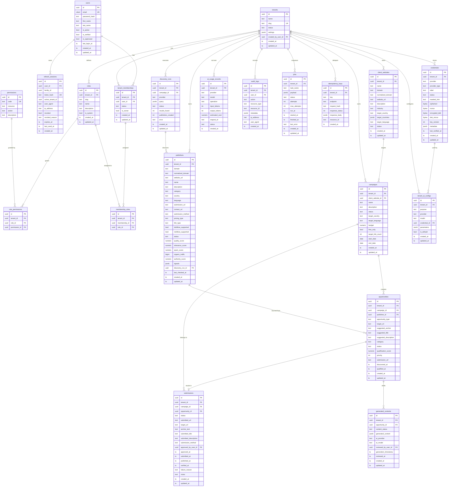
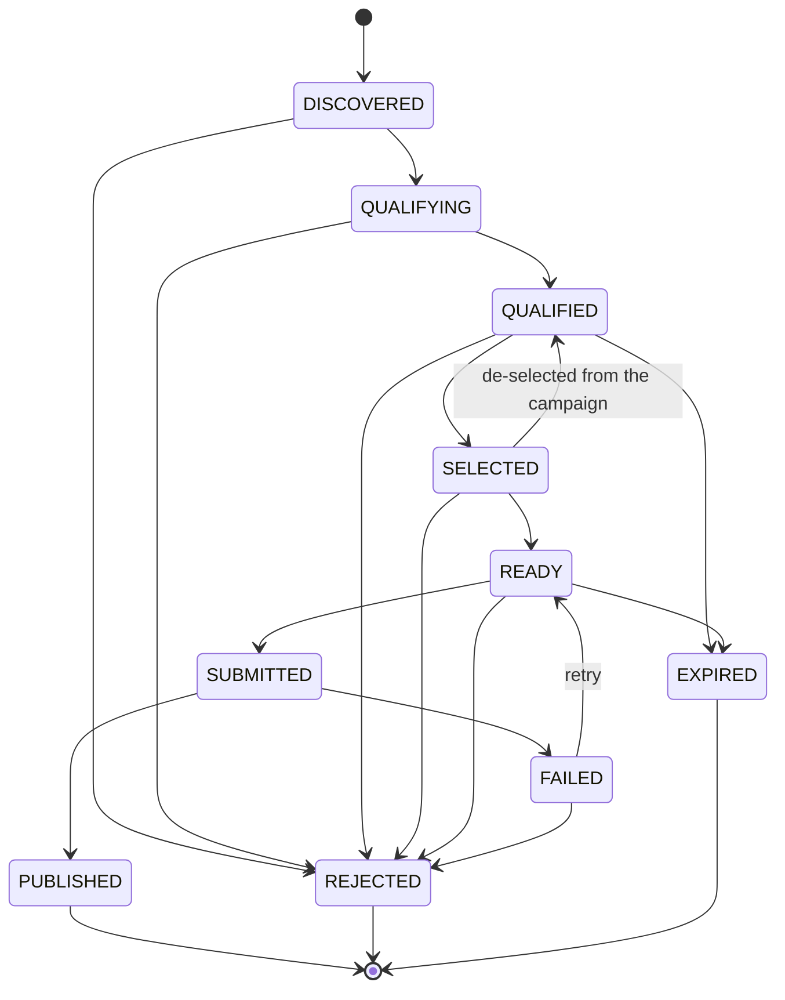
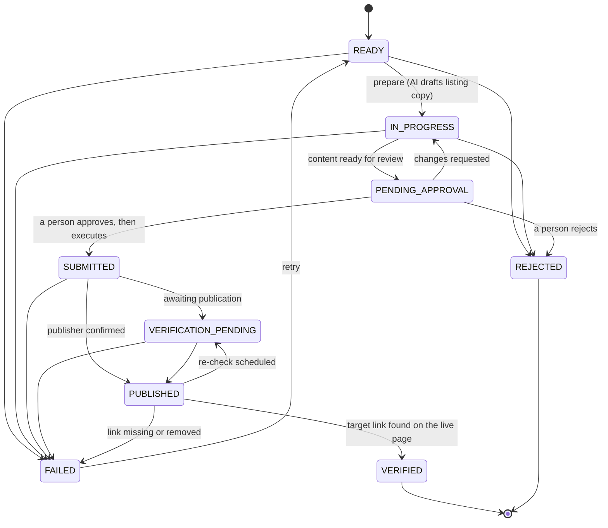

# BuildSEO — Free Listing Discovery & Submission Platform

**Backend Architecture Specification**

BuildSEO is a multi-tenant SaaS backend for discovering, qualifying, managing and
submitting links to **free** online listing/directory sites. This document is the
architectural contract the implementation follows. It is written before the code and
is the reference for every design decision in `backend/`.

---

## 1. Architecture Overview

### 1.1 Shape of the system

A **modular monolith**: one FastAPI application composed of domain modules with
explicit boundaries, one PostgreSQL database, and a worker process that runs the same
codebase against a database-backed task queue.

```
                       ┌──────────────────────────────────────────┐
   HTTP client ───────▶ │  FastAPI ASGI app (app.main)            │
                       │  ┌────────────────────────────────────┐  │
                       │  │ Middleware                         │  │
                       │  │  request-id → logging → rate-limit │  │
                       │  └────────────────────────────────────┘  │
                       │  ┌────────────────────────────────────┐  │
                       │  │ api/v1 routers  (thin)             │  │
                       │  └──────────────┬─────────────────────┘  │
                       │  ┌──────────────▼─────────────────────┐  │
                       │  │ api/dependencies                   │  │
                       │  │  principal → membership → RBAC →   │  │
                       │  │  tenant-scoped DB session          │  │
                       │  └──────────────┬─────────────────────┘  │
                       │  ┌──────────────▼─────────────────────┐  │
                       │  │ services  (business rules)         │  │
                       │  └──────────────┬─────────────────────┘  │
                       │  ┌──────────────▼─────────────────────┐  │
                       │  │ repositories (tenant-filtered SQL) │  │
                       │  └──────────────┬─────────────────────┘  │
                       └─────────────────┼────────────────────────┘
                                         │ asyncpg (SET LOCAL app.current_tenant_id)
                       ┌─────────────────▼────────────────────────┐
                       │ PostgreSQL 16 — Row-Level Security       │
                       └─────────────────▲────────────────────────┘
                                         │
   ┌─────────────────────────────────────┴────────────────────────┐
   │ worker process (app.workers.runner)                          │
   │  claims jobs FOR UPDATE SKIP LOCKED, runs task handlers      │
   │  under the job's tenant context                              │
   └──────────────────────────────────────────────────────────────┘
                                         │
                       ┌─────────────────▼────────────────────────┐
                       │ Provider abstractions (all BYOK)         │
                       │  AIProvider · DiscoveryProvider ·        │
                       │  CrawlerProvider · SubmissionProvider ·  │
                       │  MetricsProvider                         │
                       └──────────────────────────────────────────┘
```

### 1.2 Layering rules

`Router → Service → Repository → Database`. Enforced by convention and review:

| Layer | May depend on | Never does |
|---|---|---|
| `api/v1` routers | schemas, dependencies, services | business logic, SQL, direct model mutation |
| `api/dependencies` | core, auth, rbac, db | domain services beyond identity/authz |
| `services` | repositories, other services, providers, core | HTTP concerns, `Request`, `HTTPException` |
| `repositories` | models, db session | business rules, provider calls |
| `providers` | core http client, credentials | database access |

Services raise **domain exceptions** (`app/core/exceptions.py`). A single exception
handler set maps them to HTTP status codes and the error envelope. Routers never
construct `HTTPException` for domain outcomes.

### 1.3 Cross-cutting concerns

| Concern | Mechanism |
|---|---|
| Configuration | `pydantic-settings`, `app/config/settings.py`, env only |
| Logging | `structlog`-style JSON via stdlib logging, contextvars carry `request_id`/`user_id`/`tenant_id`, redaction filter strips secrets |
| Errors | domain exceptions + `app/core/error_handlers.py` |
| Tenant context | `TenantAwareSession` sets `app.current_tenant_id` / `app.current_user_id` per transaction |
| Authorization | permission-based dependency `require_permission("publisher.create")` |
| Idempotency | `Idempotency-Key` header → `idempotency_keys` table + natural unique constraints |
| Background work | `TaskQueue` protocol; `PostgresTaskQueue` default, `InMemoryTaskQueue` in tests |
| Rate limiting | `RateLimiter` protocol; in-memory token bucket default, Redis-ready |
| Outbound HTTP | one shared pooled `httpx.AsyncClient` per app lifespan, wrapped by `SafeHttpClient` |

### 1.4 Decision priority

Security → Tenant isolation → Correctness → Maintainability → Performance → Convenience.

Consequences of that ordering, applied throughout:

- RLS is `FORCE`d, and the runtime database role is `NOBYPASSRLS`, so a missing
  application-level `WHERE tenant_id = …` cannot leak data.
- Credentials are envelope-encrypted and never leave the service layer in plaintext;
  no schema exposes a decrypted value.
- Default-deny: no tenant context ⇒ zero rows, not all rows.
- Only `pricing_type = FREE` publishers can enter a submission workflow, checked in
  the service layer **and** by a database constraint on the submission path.

---

## 2. Folder Structure

```
backend/
├── app/
│   ├── main.py                     # app factory, lifespan, middleware, routers
│   ├── config/
│   │   ├── settings.py             # pydantic-settings Settings + get_settings()
│   │   └── logging.py              # JSON/console logging config, redaction
│   ├── core/
│   │   ├── context.py              # contextvars: request_id, user_id, tenant_id
│   │   ├── exceptions.py           # AuthenticationError, TenantAccessError, …
│   │   ├── error_handlers.py       # exception → error envelope
│   │   ├── responses.py            # data/meta envelope helpers
│   │   ├── pagination.py           # PageParams, SortParams, Page[T]
│   │   ├── http_client.py          # pooled async HTTP client + retries + size caps
│   │   ├── rate_limit.py           # RateLimiter protocol + in-memory bucket
│   │   ├── crypto/
│   │   │   ├── keys.py             # KeyProvider protocol, EnvMasterKeyProvider
│   │   │   └── envelope.py         # AES-256-GCM envelope encryption service
│   │   ├── security/
│   │   │   ├── password.py         # Argon2id hashing + strength policy
│   │   │   └── tokens.py           # JWT encode/decode, opaque refresh tokens
│   │   ├── ids.py                  # UUIDv7 generation
│   │   ├── domains.py              # domain/URL normalization
│   │   └── idempotency.py          # idempotency key handling
│   ├── db/
│   │   ├── base.py                 # DeclarativeBase, naming convention
│   │   ├── mixins.py               # UUIDPk, Timestamps, TenantOwned
│   │   ├── session.py              # engine, sessionmaker, TenantAwareSession
│   │   ├── context.py              # set/reset tenant GUCs
│   │   └── types.py                # reusable column types
│   ├── models/                     # SQLAlchemy 2.x models (single import surface)
│   ├── schemas/                    # Pydantic v2 request/response schemas
│   ├── repositories/               # tenant-filtered data access
│   ├── services/                   # business logic
│   ├── api/
│   │   ├── router.py               # /api/v1 aggregation
│   │   ├── dependencies/           # auth, tenant, rbac, pagination, services
│   │   └── v1/                     # one module per resource
│   ├── auth/                       # login, refresh rotation, sessions
│   ├── rbac/                       # permission catalog, role defaults, checks
│   ├── tenants/                    # tenant + membership domain
│   ├── users/
│   ├── organizations/              # client websites (tenant's client projects)
│   ├── publishers/                 # publisher domain + discovery + qualification
│   ├── opportunities/
│   ├── submissions/                # workflow state machine + providers
│   ├── campaigns/
│   ├── credentials/                # BYOK credential storage
│   ├── integrations/               # provider abstractions & implementations
│   │   ├── ai/                     # AIProvider + OpenAI/Anthropic/Gemini/OpenRouter
│   │   ├── discovery/              # PublisherDiscoveryProvider implementations
│   │   ├── crawler/                # CrawlerProvider implementations
│   │   ├── metrics/                # SEO metrics providers
│   │   └── submission/             # SubmissionProvider implementations
│   ├── audit/                      # audit log service
│   └── workers/                    # TaskQueue protocol, registry, runner, tasks
├── migrations/                     # Alembic (versions/ 0001…0018)
├── tests/
│   ├── unit/                       # pure logic: crypto, tokens, scoring, domains
│   ├── integration/                # DB, repositories, RLS, tenant isolation
│   ├── api/                        # httpx ASGI transport end-to-end
│   └── security/                   # cross-tenant, RBAC, token, leakage tests
├── scripts/                        # seed.py — permission catalog, never secrets
├── docker/postgres/init/           # app-role bootstrap for compose
├── Dockerfile
├── docker-compose.yml
├── pyproject.toml
├── alembic.ini
├── .env.example
└── README.md
```

---

## 3. Database ERD



---

## 4. Entity Relationship Explanation

**Identity is global; everything else is tenant-owned.**

- `users` and `tenants` are *global* tables. A user is one human with one login,
  independent of how many workspaces they can reach. `permissions` is a global,
  immutable catalog of capability codes.
- `tenant_memberships` is the bridge and the **only** authority on whether a user may
  touch a tenant. It carries `status` (`ACTIVE`, `SUSPENDED`, `INVITED`) and
  `is_owner`. `UNIQUE (tenant_id, user_id)`.
- `roles` are **per tenant** (`tenant_id NOT NULL`). Each new tenant is seeded with
  the five system roles (`owner`, `admin`, `seo_manager`, `seo_specialist`, `viewer`,
  `is_system = true`). Custom roles are just non-system rows, so custom RBAC needs no
  schema change. `UNIQUE (tenant_id, slug)`.
- `role_permissions` maps a tenant's role to catalog permissions.
  `membership_roles` assigns roles to a membership — a user can hold several roles in
  one tenant; effective permissions are the union.
- `refresh_sessions` is the server-side session/token-family store. It holds only a
  SHA-256 hash of the opaque refresh token, never the token.

**The SEO domain.**

- `client_websites` are the tenant's own clients/projects — the things being promoted.
- `campaigns` belong to exactly one `client_website` (and therefore one tenant) and
  carry link goals. `free_only` defaults to `true` and, for the MVP, is constrained to
  `true`.
- `publishers` are candidate listing sites, owned per tenant so one tenant's research,
  scores and notes never bleed into another's. `normalized_domain` is the canonical
  identity used for de-duplication; `UNIQUE (tenant_id, normalized_domain)`.
- `opportunities` are the join of "this campaign wants a link" × "this publisher may
  accept one", with lifecycle status and scores.
  `UNIQUE (tenant_id, campaign_id, publisher_id, target_url)` prevents duplicates from
  retries or re-runs.
- `submissions` record the act of submitting one opportunity.
  `UNIQUE (tenant_id, opportunity_id)` on live rows keeps one active submission per
  opportunity (terminal `FAILED`/`REJECTED` rows are excluded via a partial index so a
  retry is possible).
- `generated_contents` stores AI-drafted listing copy **before** submission, with
  provider/model/timestamp, so a human reviews an auditable artifact.

**BYOK and operations.**

- `credentials` holds per-tenant, per-provider secrets as envelope-encrypted bytes.
- `tenant_ai_configs` selects provider + model + credential per *purpose*
  (`content_generation`, `discovery`, `qualification`, `embedding`) so the business
  layer asks for a purpose, not a vendor.
- `ai_usage_records`, `audit_logs`, `jobs`, `discovery_runs` and `idempotency_keys` are
  tenant-owned operational tables.

---

## 5. RLS Strategy

### 5.1 Threat model

Assume the application will one day contain a query that forgets `WHERE tenant_id = …`.
PostgreSQL must still refuse to return, modify or delete another tenant's rows.

### 5.2 Roles

| Role | Purpose | RLS |
|---|---|---|
| `buildseo` (compose `POSTGRES_USER`) | owns schema, runs Alembic | superuser in dev — bypasses RLS, so **never** used by the API |
| `buildseo_app` | the API and worker runtime role | `NOSUPERUSER`, `NOBYPASSRLS` — fully subject to policies |

`FORCE ROW LEVEL SECURITY` is set on every protected table so that even the table
*owner* is subject to policies. This closes the "dev runs as owner" hole; the only
remaining bypass is a cluster superuser, which the runtime never is.

### 5.3 Context propagation

Two session GUCs, set with `set_config(name, value, is_local => true)` so PostgreSQL
discards them at transaction end — the mechanism that prevents leakage across pooled
connections:

```
app.current_tenant_id   -- active tenant, derived from validated membership
app.current_user_id     -- authenticated user
```

Both are **server-derived**. `app.current_tenant_id` comes from a
`tenant_memberships` row looked up for the authenticated `sub` claim; a tenant id in a
request body or header is only ever a *candidate* that must survive membership
validation. The value is passed as a bound parameter, never interpolated.

`TenantAwareSession` (a small `AsyncSession` subclass) remembers the context and
re-applies it after any `commit()`, so a mid-request commit cannot silently continue
in an unscoped transaction.

Helper functions in SQL:

```sql
CREATE FUNCTION app_current_tenant_id() RETURNS uuid LANGUAGE sql STABLE AS $$
  SELECT nullif(current_setting('app.current_tenant_id', true), '')::uuid $$;
CREATE FUNCTION app_current_user_id() RETURNS uuid LANGUAGE sql STABLE AS $$
  SELECT nullif(current_setting('app.current_user_id', true), '')::uuid $$;
```

### 5.4 Policy shape

For every tenant-owned table:

```sql
ALTER TABLE publishers ENABLE ROW LEVEL SECURITY;
ALTER TABLE publishers FORCE ROW LEVEL SECURITY;

CREATE POLICY publishers_tenant_isolation ON publishers
  USING      (tenant_id = app_current_tenant_id())
  WITH CHECK (tenant_id = app_current_tenant_id());
```

- `USING` filters `SELECT`/`UPDATE`/`DELETE`.
- `WITH CHECK` blocks `INSERT`/`UPDATE` that would write another tenant's id — so a
  tenant cannot *plant* a row in another tenant either.
- Unset context ⇒ `app_current_tenant_id()` is `NULL` ⇒ predicate is `NULL` ⇒ **no
  rows, default deny**.

`tenant_memberships` needs one extra permissive policy, because "which tenants may I
enter?" is answered *before* a tenant is chosen:

```sql
CREATE POLICY memberships_self_access ON tenant_memberships
  USING (user_id = app_current_user_id());
```

Permissive policies OR together: a membership row is visible if it belongs to the
current tenant **or** to the current user. The policy is `SELECT`-only —
discovering a membership must not mean editing one.

**The policy is inert unless the principal is bound first.** It keys on
`app_current_user_id()`, so a membership read on a session with no user context
returns nothing, exactly like a read with no tenant context. Every read of this
table therefore has to be preceded by a binding, and the reads that decide
*which* workspace to enter run before any tenant is known — so the binding must
set the user **without** setting a tenant.

`TenantAwareSession.set_user_context(user_id)` is that primitive. It
deliberately is not `set_tenant_context(tenant_id=None, user_id=…)`, which
would bind the user by clearing a tenant already established earlier in the
request, making the next tenant-scoped read fail `require_tenant_id()`.

Two places call it, which between them cover every path:

| Caller | Why it cannot be left to the other |
| --- | --- |
| `get_principal` | Binds once per request, before `get_tenant_context` re-validates membership. FastAPI caches the session per request, so this scopes every later read on it. It cannot live in `get_unscoped_session`, which has no principal yet — the token must be validated first, and the tables that do that (`users`, `refresh_sessions`) are global and readable unbound. |
| `AuthService._require_membership` | The tenant-authorisation choke point. Login and refresh reach it without any principal dependency having run, so the request layer cannot bind for them. |

Getting this wrong is not a subtle degradation: it is a hard bootstrap
deadlock. Every tenant-scoped endpoint returns `403 TENANT_ACCESS_DENIED` for a
legitimate member, while `/me` reports no workspaces — so the caller can
neither select a workspace nor discover one to select. `tests/api/test_bootstrap.py`
and `TestMembershipSelfRead` in `tests/security` exist to keep it fixed.

### 5.5 Deliberately excluded tables

`users`, `tenants`, `permissions`, `refresh_sessions` carry no `tenant_id` and are not
tenant-owned. They must be reachable before a tenant is chosen (login, token refresh,
tenant list, tenant creation), so putting them behind a tenant predicate would break
authentication rather than protect it. They are protected by:

- application-level scoping in repositories (`users` are only ever listed through a
  membership join for the active tenant),
- membership validation in dependencies,
- `refresh_sessions` rows keyed to `user_id` and matched by token hash.

This exclusion is a conscious, documented boundary — not an oversight. Every table
with a `tenant_id` column is covered, which is asserted by an automated test that
reflects the schema and fails if a `tenant_id` table lacks `relforcerowsecurity` and a
policy.

### 5.6 Proving it

`tests/security/test_tenant_isolation_rls.py` runs as `buildseo_app` and asserts, for
each protected table, that with tenant A's context: a tenant-B row is invisible to
`SELECT`, `UPDATE … WHERE id = <B row>` affects 0 rows, `DELETE` affects 0 rows, an
`INSERT` carrying tenant B's id raises, and `SELECT … WHERE id = <B id>` (ID guessing)
returns nothing. A no-context test asserts zero rows everywhere.

---

## 6. Authentication Architecture

### 6.1 Tokens

| | Access | Refresh |
|---|---|---|
| Format | JWT (HS256, `JWT_SECRET`) | 256-bit opaque, URL-safe base64 |
| Lifetime | `JWT_ACCESS_TOKEN_EXPIRE_MINUTES`, default 15 min | `JWT_REFRESH_TOKEN_EXPIRE_DAYS`, default 14 |
| Storage | client only | server stores **SHA-256 hash only** |
| Claims | `sub`, `jti`, `sid`, `tid?`, `typ=access`, `iat`, `nbf`, `exp`, `iss`, `aud` | n/a |

Refresh tokens are opaque, not JWTs: revocation must be authoritative, and an opaque
token that is worthless without its database row gives that for free.

### 6.2 Flows

```
POST /auth/register     create user (+ optional first tenant, seeded roles, owner membership)
POST /auth/login        email+password → verify Argon2id → session row → access+refresh
POST /auth/refresh      rotate: verify hash → revoke old → issue new pair (same family)
POST /auth/logout       revoke current session (or whole family)
POST /auth/select-tenant validate membership → new access token carrying tid
GET  /auth/sessions     list active sessions/devices
DELETE /auth/sessions/{id} revoke a session
```

### 6.3 Rotation and reuse detection

```
family_id groups every token descended from one login
refresh(token):
  h = sha256(token)
  row = SELECT … WHERE token_hash = h            -- constant-time by construction
  if row is None                → AuthenticationError
  if row.revoked                → revoke ENTIRE family, AuthenticationError  (replay!)
  if row.expires_at <= now()    → AuthenticationError
  revoke(row, reason="rotated"); insert new row in same family; return new pair
```

Reuse of an already-rotated token means the token leaked, so the whole family dies.
Sessions carry `user_agent`, `ip_address`, `last_used_at` for device management.

### 6.4 Tenant selection

The JWT never hard-binds a user to one tenant for life. `tid` is the *currently
selected* tenant and is re-validated against `tenant_memberships` on **every** request
— a stale or forged `tid` is worthless. `POST /auth/select-tenant` (or the
`X-Tenant-ID` header, equally validated) switches the active tenant.

### 6.5 Passwords

Argon2id (`argon2-cffi`), parameterized by config, with automatic re-hash on login
when parameters change. Strength policy: length ≥ 12, upper/lower/digit/symbol mix,
rejection of a common-password list and of email/name-derived passwords. Login returns
one indistinguishable error for unknown email and wrong password, and always performs
a hash verification against a dummy hash to avoid a user-enumeration timing oracle.

---

## 7. RBAC Architecture

```
user ──membership──▶ tenant
          │
          ├─ membership_roles ──▶ roles (per tenant)
                                   │
                                   └─ role_permissions ──▶ permissions (global catalog)
```

Authorization is **only ever** a permission check. There is no `if role == "admin"`
anywhere in the codebase; role names exist for humans.

```python
@router.post("/publishers", dependencies=[Depends(require_permission(Perm.PUBLISHER_CREATE))])
```

`require_permission` resolves the caller's effective permission set once per request
(single query joining membership → membership_roles → role_permissions → permissions),
caches it on the request principal, and raises `AuthorizationError` (403) on a miss.
`require_any_permission` / `require_all_permissions` cover compound cases.

### 7.1 Permission catalog

`tenant.{read,update}`, `user.{read,create,update,delete}`,
`role.{read,create,update,delete}`, `permission.read`,
`client_website.{read,create,update,delete}`, `campaign.{read,create,update,delete}`,
`publisher.{read,create,update,delete}`, `publisher.discover`, `publisher.qualify`,
`opportunity.{read,create,update,delete}`, `submission.{read,create,update,delete}`,
`submission.approve`, `submission.verify`, `credential.{read,create,update,delete}`,
`integration.{read,create,update,delete}`, `ai.generate`, `ai.usage_read`, `audit.read`,
`job.{read,create}`.

### 7.2 Default roles

| Role | Grant |
|---|---|
| **Owner** | every permission, including `tenant.update` and member/role administration |
| **Admin** | everything except ownership transfer and tenant deletion |
| **SEO Manager** | full campaign/publisher/opportunity/submission lifecycle incl. `submission.approve`, read-only on users/roles/credentials |
| **SEO Specialist** | read + create/update on opportunities and submissions, `ai.generate`; no approve, no delete, no credentials |
| **Viewer** | all `*.read` except `credential.read` and `audit.read` |

Seeded per tenant at creation, so a tenant may edit a copy of a role without affecting
anyone else. Custom roles are created through `POST /roles` with an explicit
permission list.

---

## 8. BYOK / Security Architecture

### 8.1 Envelope encryption

```
plaintext secret
   │  AES-256-GCM with a per-credential random DEK
   ▼
ciphertext + nonce ────────────────────────┐
                                            ├─▶ credentials row
DEK ─ AES-256-GCM with master KEK ─▶ encrypted_dek + dek_nonce + key_version
                                            ┘
master KEK ← ENCRYPTION_KEY (base64, 32 bytes) from env / secret manager
```

- A per-credential DEK means one compromised ciphertext does not compromise the rest,
  and re-keying rewraps DEKs without touching secret material.
- AAD binds each ciphertext to `tenant_id` + `credential_id` + `provider`, so a
  ciphertext moved between rows or tenants fails authentication.
- `KeyProvider` is a protocol; `EnvMasterKeyProvider` reads env today, an
  `AwsKmsKeyProvider`/`VaultKeyProvider` drops in later with no call-site changes.
  `key_version` is stored per row to support rotation.

### 8.2 Non-negotiables

- No provider key is ever in a response schema. `CredentialRead` exposes
  `provider`, `provider_type`, `label`, `status`, `masked_hint` (`sk-…abcd`),
  `last_verified_at`, timestamps — and nothing else. There is no "reveal" endpoint.
- Decryption happens only inside `CredentialService.resolve_secret()`, which returns a
  `SecretStr`-like wrapper consumed directly by a provider client.
- The logging redaction filter drops `authorization`, `password`, `token`,
  `refresh_token`, `api_key`, `secret`, `encryption_key`, `set-cookie` keys and any
  value matching known key prefixes, at the log-record level, so an accidental
  `logger.info(payload)` cannot leak.
- Audit metadata is built from allow-listed fields, never from raw request bodies.

### 8.3 Provider abstraction

```python
class AIProvider(Protocol):
    async def generate(self, request: GenerationRequest) -> GenerationResult: ...
    async def embed(self, request: EmbeddingRequest) -> EmbeddingResult: ...

class PublisherDiscoveryProvider(Protocol):
    async def search(self, query: DiscoveryQuery) -> list[DiscoveredPublisher]: ...

class CrawlerProvider(Protocol):
    async def fetch_site(self, url: str) -> SiteSnapshot: ...

class SubmissionProvider(Protocol):
    async def submit(self, request: SubmissionRequest) -> SubmissionOutcome: ...
```

Business code depends on the protocol and on a *purpose*
(`AIProviderFactory.for_purpose(tenant, "content_generation")`). Swapping OpenAI for
Anthropic is a `tenant_ai_configs` row change. No vendor SDK is imported outside
`app/integrations/`; every implementation speaks HTTP through the shared client.

Every AI call writes an `ai_usage_records` row (provider, model, operation, tokens,
estimated cost, request id, status). Prompts are **not** stored; only the accepted
output is persisted, in `generated_contents`.

---

## 9. API Endpoint Inventory

92 endpoints: 3 unauthenticated health probes plus 89 under `/api/v1`.
Every success response uses the `data`/`meta` envelope and every failure the
`error` envelope, so a client can branch on shape alone.

`A` = requires an access token. `T` = requires an active tenant context
(`X-Tenant-ID`, or the token's `tid` claim, re-validated against membership on
every request). Authorization is always by permission code; role names are never
compared anywhere in the codebase.

`tests/api/test_openapi_contract.py` fails if any route is missing a summary, a
description, a tag or the error responses a caller has to handle, so this table
cannot drift far from the code without a test going red.

### Health (unauthenticated)

| Method | Path | Auth | Permission |
|---|---|---|---|
| GET | `/health` | – | – |
| GET | `/health/live` | – | – |
| GET | `/health/ready` | – | – |

### Authentication

| Method | Path | Auth | Permission |
|---|---|---|---|
| POST | `/auth/register` | – | – |
| POST | `/auth/login` | – | – |
| POST | `/auth/refresh` | – | – |
| POST | `/auth/logout` | A | – |
| POST | `/auth/select-tenant` | A | – |
| GET | `/auth/sessions` | A | – |
| DELETE | `/auth/sessions/{session_id}` | A | – |

### The authenticated user

| Method | Path | Auth | Permission |
|---|---|---|---|
| GET | `/me` | A | – |
| PATCH | `/me` | A | – |
| POST | `/me/password` | A | – |
| GET | `/me/tenants` | A | – |

### Workspaces and membership

| Method | Path | Auth | Permission |
|---|---|---|---|
| GET | `/tenants` | A | – |
| POST | `/tenants` | A | – |
| GET | `/tenants/{tenant_id}` | A+T | `tenant.read` |
| PATCH | `/tenants/{tenant_id}` | A+T | `tenant.update` |
| GET | `/tenants/{tenant_id}/members` | A+T | `user.read` |
| POST | `/tenants/{tenant_id}/members` | A+T | `user.create` |
| PATCH | `/tenants/{tenant_id}/members/{membership_id}` | A+T | `user.update` |
| DELETE | `/tenants/{tenant_id}/members/{membership_id}` | A+T | `user.delete` |

### Users

| Method | Path | Auth | Permission |
|---|---|---|---|
| GET | `/users` | A+T | `user.read` |
| GET | `/users/{user_id}` | A+T | `user.read` |

### Roles and permissions

| Method | Path | Auth | Permission |
|---|---|---|---|
| GET | `/permissions` | A+T | `permission.read` |
| GET | `/roles` | A+T | `role.read` |
| POST | `/roles` | A+T | `role.create` |
| GET | `/roles/{role_id}` | A+T | `role.read` |
| PATCH | `/roles/{role_id}` | A+T | `role.update` |
| DELETE | `/roles/{role_id}` | A+T | `role.delete` |

### Client websites

| Method | Path | Auth | Permission |
|---|---|---|---|
| GET | `/client-websites` | A+T | `client_website.read` |
| POST | `/client-websites` | A+T | `client_website.create` |
| GET | `/client-websites/{website_id}` | A+T | `client_website.read` |
| PATCH | `/client-websites/{website_id}` | A+T | `client_website.update` |
| DELETE | `/client-websites/{website_id}` | A+T | `client_website.delete` |

### Campaigns

| Method | Path | Auth | Permission |
|---|---|---|---|
| GET | `/campaigns` | A+T | `campaign.read` |
| POST | `/campaigns` | A+T | `campaign.create` |
| GET | `/campaigns/{campaign_id}` | A+T | `campaign.read` |
| PATCH | `/campaigns/{campaign_id}` | A+T | `campaign.update` |
| DELETE | `/campaigns/{campaign_id}` | A+T | `campaign.delete` |
| GET | `/campaigns/{campaign_id}/stats` | A+T | `campaign.read` |

### Publishers (discovery and qualification)

| Method | Path | Auth | Permission |
|---|---|---|---|
| GET | `/publishers` | A+T | `publisher.read` |
| POST | `/publishers` | A+T | `publisher.create` |
| GET | `/publishers/discovery-providers` | A+T | `publisher.read` |
| GET | `/publishers/discovery-runs` | A+T | `publisher.read` |
| POST | `/publishers/discover` | A+T | `publisher.discover` |
| GET | `/publishers/{publisher_id}` | A+T | `publisher.read` |
| PATCH | `/publishers/{publisher_id}` | A+T | `publisher.update` |
| DELETE | `/publishers/{publisher_id}` | A+T | `publisher.delete` |
| POST | `/publishers/{publisher_id}/qualify` | A+T | `publisher.qualify` |
| POST | `/publishers/{publisher_id}/qualify-async` | A+T | `publisher.qualify` |

### Opportunities and generated content

| Method | Path | Auth | Permission |
|---|---|---|---|
| GET | `/opportunities` | A+T | `opportunity.read` |
| POST | `/opportunities` | A+T | `opportunity.create` |
| GET | `/opportunities/state-machine` | A+T | `opportunity.read` |
| GET | `/opportunities/{opportunity_id}` | A+T | `opportunity.read` |
| PATCH | `/opportunities/{opportunity_id}` | A+T | `opportunity.update` |
| DELETE | `/opportunities/{opportunity_id}` | A+T | `opportunity.delete` |
| POST | `/opportunities/{opportunity_id}/qualify` | A+T | `opportunity.update` |
| POST | `/opportunities/{opportunity_id}/select` | A+T | `opportunity.update` |
| POST | `/opportunities/{opportunity_id}/reject` | A+T | `opportunity.update` |
| POST | `/opportunities/{opportunity_id}/transition` | A+T | `opportunity.update` |
| POST | `/opportunities/{opportunity_id}/generate-content` | A+T | `ai.generate` |
| GET | `/opportunities/{opportunity_id}/content` | A+T | `opportunity.read` |
| POST | `/opportunities/{opportunity_id}/content/{content_id}/review` | A+T | `opportunity.update` |

### Submissions (approval-gated)

| Method | Path | Auth | Permission |
|---|---|---|---|
| GET | `/submissions` | A+T | `submission.read` |
| POST | `/submissions` | A+T | `submission.create` |
| GET | `/submissions/state-machine` | A+T | `submission.read` |
| GET | `/submissions/review-queue` | A+T | `submission.read` |
| GET | `/submissions/{submission_id}` | A+T | `submission.read` |
| PATCH | `/submissions/{submission_id}` | A+T | `submission.update` |
| DELETE | `/submissions/{submission_id}` | A+T | `submission.delete` |
| POST | `/submissions/{submission_id}/submit-for-review` | A+T | `submission.update` |
| POST | `/submissions/{submission_id}/approve` | A+T | `submission.approve` |
| POST | `/submissions/{submission_id}/execute` | A+T | `submission.update` |
| POST | `/submissions/{submission_id}/verify` | A+T | `submission.verify` |
| POST | `/submissions/{submission_id}/verify-async` | A+T | `submission.verify` |
| POST | `/submissions/{submission_id}/transition` | A+T | `submission.update` |

### BYOK credentials

| Method | Path | Auth | Permission |
|---|---|---|---|
| GET | `/credentials` | A+T | `credential.read` |
| POST | `/credentials` | A+T | `credential.create` |
| GET | `/credentials/{credential_id}` | A+T | `credential.read` |
| PATCH | `/credentials/{credential_id}` | A+T | `credential.update` |
| DELETE | `/credentials/{credential_id}` | A+T | `credential.delete` |
| POST | `/credentials/{credential_id}/verify` | A+T | `credential.update` |

### AI configuration and usage

| Method | Path | Auth | Permission |
|---|---|---|---|
| GET | `/ai/configs` | A+T | `integration.read` |
| PUT | `/ai/configs` | A+T | `integration.update` |
| DELETE | `/ai/configs/{config_id}` | A+T | `integration.delete` |
| GET | `/ai/usage` | A+T | `ai.usage_read` |
| GET | `/ai/usage/summary` | A+T | `ai.usage_read` |

### Audit trail

| Method | Path | Auth | Permission |
|---|---|---|---|
| GET | `/audit-logs` | A+T | `audit.read` |

### Background jobs

| Method | Path | Auth | Permission |
|---|---|---|---|
| GET | `/jobs` | A+T | `job.read` |
| GET | `/jobs/task-types` | A+T | `job.read` |
| GET | `/jobs/{job_id}` | A+T | `job.read` |

Collections accept `page`, `page_size`, `sort`, `order`, `q` (search) and
resource-specific filters (`status`, `pricing_type`, `campaign_id`, `country`, …).
Sort fields are validated against a per-resource allow-list, so an unrecognised
field is a 422 rather than a silent fallback to some other ordering.

Endpoints that create a resource accept an optional `Idempotency-Key` header:
replaying the same key returns the original response instead of creating a
duplicate, and reusing one key with a different body is a 409.

---

## 10. State Machines

Both lifecycles are declarative transition tables (`app/opportunities/workflow.py`,
`app/submissions/workflow.py`) rather than conditionals spread through the
services. Three reasons that matters:

* the legal moves are reviewable in one place, which is what a workflow with a
  human approval gate needs;
* `GET /opportunities/state-machine` and `GET /submissions/state-machine`
  publish the tables, so a client renders exactly the actions the backend will
  accept;
* an illegal move is one `InvalidStateTransitionError` (409) instead of a
  subtly wrong state written by a code path nobody checked.

The diagrams below are the tables, edge for edge.

### Opportunity lifecycle



`PUBLISHED`, `REJECTED` and `EXPIRED` are terminal. A submission may only be
prepared from `SELECTED` or `READY`.

### Submission lifecycle

The human-in-the-loop gate is `PENDING_APPROVAL → SUBMITTED`.



`VERIFIED` and `REJECTED` are terminal; `FAILED` is the one non-terminal
dead-end, and only because a retry starts a fresh attempt from `READY`.

### Rules that hold regardless of the caller

1. **Transitions outside the table are refused.** 409
   `INVALID_STATE_TRANSITION`. `SUBMITTED` is unreachable from `READY`: the
   only edge into it starts at `PENDING_APPROVAL`.
2. **FREE publishers only.** A submission cannot exist for an opportunity whose
   publisher is not `pricing_type = FREE`. Checked in `SubmissionService` *and*
   by the `enforce_submission_free_only` trigger (revision `0013`). The trigger
   is deliberately **not** `SECURITY DEFINER`, so it runs under the caller's own
   RLS and fails closed on an opportunity the caller cannot see rather than
   assuming `FREE`.
3. **Nothing is sent without a recorded approval.** Reaching `SUBMITTED`,
   `PUBLISHED`, `VERIFICATION_PENDING` or `VERIFIED` requires both
   `approved_by_user_id` and `approved_at`, set by a caller holding
   `submission.approve` — enforced by
   `ck_submissions_submitted_requires_approval`, so it holds even for a direct
   SQL update. Editing a submission after approval clears the approval, so the
   content that was signed off is the content that is sent.
4. **One live submission per opportunity.** A partial unique index
   (`uq_submissions_tenant_id_opportunity_id_live`) excludes `REJECTED` and
   `FAILED`, so a failed attempt can be retried with a fresh row while the
   history survives.
5. **No automatic delivery in this MVP.** `FormSubmissionProvider` pre-flights a
   target and is constructed with `allow_automatic_submission=False`, so it
   always returns `BLOCKED_REQUIRES_MANUAL` and a person completes the
   submission. It stops outright on a CAPTCHA, a login wall, an anti-bot
   challenge or terms prohibiting automation, and records which of those it
   found. **No CAPTCHA solving, no anti-bot evasion, no circumvention of
   publisher restrictions** — these are product boundaries, not unfinished
   work.
6. **Verification is an abstraction.** `LinkVerifier` fetches the submitted URL
   and looks for the target link, recording the HTTP status, whether the link
   was found and the `rel` attribute observed. It never mutates publisher state.

---

## 11. Migration Plan

Alembic only; one concern per revision, each with a working `downgrade`.

| # | Revision | Contents |
|---|---|---|
| 0001 | `initial_extensions` | `pgcrypto`, `citext`, `app_current_tenant_id()`, `app_current_user_id()`, `set_updated_at()` trigger fn |
| 0002 | `users` | users table + indexes |
| 0003 | `tenants` | tenants table |
| 0004 | `memberships` | tenant_memberships |
| 0005 | `permissions` | global permission catalog |
| 0006 | `roles` | per-tenant roles |
| 0007 | `rbac_links` | role_permissions, membership_roles |
| 0008 | `refresh_sessions` | session/token-family store |
| 0009 | `client_websites` | client websites |
| 0010 | `campaigns` | campaigns (+ `free_only` MVP check) |
| 0011 | `publishers` | publishers, discovery_runs |
| 0012 | `opportunities` | opportunities |
| 0013 | `submissions` | submissions, generated_contents (+ FREE-only trigger) |
| 0014 | `credentials` | credentials, tenant_ai_configs |
| 0015 | `ai_usage` | ai_usage_records |
| 0016 | `audit_jobs_idempotency` | audit_logs, jobs, idempotency_keys |
| 0017 | `rls_policies` | ENABLE + FORCE RLS and policies on every tenant-owned table |
| 0018 | `indexes_and_grants` | composite/partial indexes, grants to the app role |

Rules: no manual production DDL; every tenant-owned table gets its RLS in 0017 so the
policy set is reviewable in one place; grants are applied to a configurable role name
(`DB_APP_ROLE`) and skipped if the role is absent, so the same migration runs in CI,
dev and production.

---

## 12. Testing Strategy

| Suite | Scope | How |
|---|---|---|
| `tests/unit` | UUIDv7 monotonicity, Argon2id hashing and the password policy, JWT encode/decode/expiry/algorithm pinning, refresh-token hashing, envelope encryption including AAD tampering and rewrap, domain and URL normalisation, SSRF guarding, log redaction, scoring and hard rejections, both state machines, pagination, provider adapters, audit-metadata sanitisation, settings hardening | pure functions; no database and no web stack, so the suite is usable as a pre-commit check |
| `tests/integration` | repository tenant scoping (including the refusal to query with no context), transaction and tenant-context lifecycle under pooling, unique and partial-unique constraints, check constraints, the FREE-only trigger, the approval gate, the idempotency ledger and its retention sweep, `FOR UPDATE SKIP LOCKED` claim semantics with backoff and stale-job requeue, seeded permission/role correctness and ladder nesting | real PostgreSQL; the schema is built by running Alembic from empty, so "migrations apply from scratch" is asserted on every run |
| `tests/security` | **RLS**: cross-tenant read, read-by-id, `UPDATE`, `DELETE` and `INSERT` per table; unfiltered statements touching only the active tenant; no-context default deny; a schema audit that every table with a `tenant_id` is protected; RBAC denial per permission; expired, revoked, forged and wrong-`typ` tokens; refresh reuse detection; credential non-disclosure | runs as `buildseo_app`, which is `NOSUPERUSER` and `NOBYPASSRLS` — asserting isolation over a superuser connection would prove nothing |
| `tests/api` | registration and login, tenant selection and switching, CRUD and validation errors, pagination/filtering/sorting, the error-envelope shape, the whole submission workflow through its approval gate, BYOK credentials and AI configuration, the audit trail, the job queue, and an OpenAPI contract check that every route is documented and no response schema has a field capable of carrying a secret | `httpx.AsyncClient` over `ASGITransport`, so the full middleware, dependency and exception-handler stack runs with no socket |

Two engines are provided to the database suites and the distinction is the
point: an owner-role engine for seeding fixtures and for policy-independent
assertions, and a runtime-role engine for every isolation test. Fixtures build
two fully-populated workspaces (A and B) with their own users, roles, client
sites, campaigns, publishers, opportunities and credentials, so a cross-tenant
assertion always has a second tenant that demonstrably has data.

Acceptance gate: `ruff check`, `black --check`, `mypy app`, and the full
`pytest` suite green against a database built purely from migrations.
